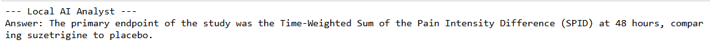
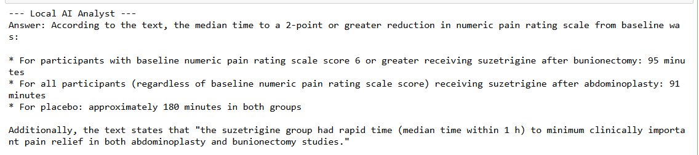

# 🩺 Local Medical AI Analyst (RAG System)

## 📌 Project Overview
This project implements a **Retrieval-Augmented Generation (RAG)** pipeline designed to analyze complex medical research papers. Unlike standard LLMs that may hallucinate, this system "grounds" its answers in specific technical documents, ensuring high factual accuracy for clinical data.

To ensure 100% data privacy and zero cost, this project runs entirely locally using **Ollama** and **Llama 3**.

## 🧠 Key Technologies
* **LLM:** Llama 3 (via Ollama)
* **Orchestration:** LangChain (LCEL)
* **Vector Database:** ChromaDB / DocArray
* **Embeddings:** Local Ollama Embeddings
* **Document Loading:** PyPDFLoader

## 🛠️ Architecture
1. **Ingestion**: Documents are split using ```RecursiveCharacterTextSplitter``` to preserve semantic integrity.
2. **Retrieval**: Relevant text chunks are fetched via semantic similarity search.
3. **Generation**: Llama 3 synthesizes an answer based only on the retrieved context.

## 🧪 Real-Time Performance & Results
The system was tested using a 2025 Phase 3 clinical trial paper for **Suzetrigine** from PubMed. Below are the verified results showing the model's ability to extract precise clinical endpoints.

### 1. Primary Endpoint Extraction
The model successfully identified the complex primary metric (SPID48) used in the study.


### 2. Comparative Clinical Data
Llama 3 demonstrated high reasoning capabilities by accurately comparing the time to relief for different surgery types.


## 🚀 How to Run Locally

### Prerequisites
1. **Ollama Installed:** [Download here](https://ollama.com/)
2. **Model Pulled:**
   ```
   ollama pull llama3
   ```

### Installation
```
pip install langchain langchain-community langchain-ollama pypdf chromadb
```

### Execution
1. Place your medical PDF in the root directory.
2. Run the Python script to start the local RAG analyst.
3. Ask technical questions like: "What was the median time to pain relief for the abdominoplasty group?"
